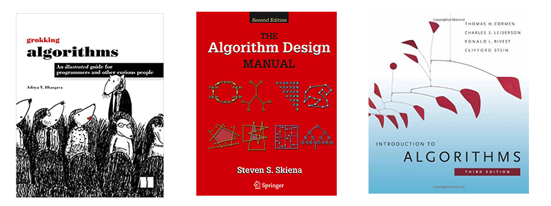

# Алгоритми та структури даних
В цьому репозиторії зібрані загальні правила здачі, завдання та посилання на матеріали двох частин курсу "Алгоритми та структури даних".

## Яку структуру має курс?
1. Два загальних заняття на тиждень. Одне - з лекційним матералом, друге - більше практичні аспекти програмування та реалізації.
2. Два заняття для здачі лабораторних робіт та питань по ним. До цих занять потрібно готуватись - навіть якщо ви ще не готові здавати роботу, прочитайте завдання, сформулюйте питання та прийдіть на заняття щоб задати їх та послухати інших.
3. Чотири групові практичні роботи кожен терм (загалом - 8).
4. Одне індивідуальне завдання на терм.
5. Мід-терм екзамен та фінальний екзамен

## Як виконувати практичні завдання?
В цьому курсі всі практичні (крім одного індивідуального завдання на терм) розраховані на виконання в маленьких групах з двох студентів. Це дозволяє виконувати більш складні та цікаві завдання, а також отримати реальний досвід командної роботи та роботи з git. Вам необов'язково обирати одного напарника на весь терм, ви можете здавати кожну наступну роботу в іншій команді. Якщо по якійсь причині ви не змогли підібрати собі напарника - повідомте про це комусь із викладачів якомога раніше.

Отже, після того як ви визначились з напарником:
1. Прочитайте практичне завдання, перегляньте посилання та матеріали.
2. Уважно перегляньте контрольні питання та повідповідайте на них.
3. Обговоріть та розподіліть роботу на двох - хто буде відповідальний за яку частину роботи.
4. Прочитайте [гайд початку роботи](./quickstart.md)
5. Створіть репозиторій на гітхаб для цієї роботи.
6. Починайте виконувати завдання, робіть комміти якомога частіше - фактично, ви можете робити комміт після кожного маленького майлстоуну виконання роботи. Чим більше буде коммітів в моменти коли ви щось реалізували, тим простіше буде за необхідності відкотитись до якоїсь з робочих версій, чи прослідкувати коли ви внесли які зміни.
7. Після того як ви виконали завдання, розберіться з тією частиною коду, що писав ваш напарник - ви маєте знати та розуміти як вона працює, для того щоб мати змогу відповідати на питання та робити завдання.
8. Роботу можна здавати!

Якщо у вас на будь-якому етапі виникають питання - приходьте на практичну, office hours, або скористайтесь чатом в соцмережах для того щоб їх задати.

## Правила здачі
1. Кожне завдання має два дедлайни - _soft_, після якого можна набрати тільки половину балів, та _hard_, після якого бали не зараховуються.
2. Роботи, залиті на гіт одним комітом, формально поділені на коміти шляхом заливання шматків готового коду, або залиті через веб-інтерфейс не приймаються. Робота з системою контроля версій - важлива навичка для розробника.
3. Якщо хтось з членів команди не має комітів у репозиторії, то він не зможе набрати бали за цю роботу. Навіть якщо ви змушені працювати за одним комп'ютером, ви можете створити два акаунти у git (зверніться по допомогу з цим питанням у разі необхідності).
4. Ви можете корситуватися як командним рядком для роботи з git, так і обрати собі зручний клієнт.
5. Кожен член команди має володіти володіти всім матеріалом та розуміти код всієї роботи.
6. Будь-який виявлений плагіат у роботах буде каратись анулюванням роботи з оцінкою 0. Завдання мають бути виконані самостійно, навіть якщо ви шукали якісь додаткові матеріали по темі (відео, лекції, книжки, зразки), після того як ви ознайомитесь з ними, закрийте це джерело та пишіть все по пам'яті самостійно. На даному етапі, не користуйтесь комбінацію `ctrl+C`/`ctrl+V` для коду взагалі (крім випадків де прямо вказано інше)  

## Список практичних завдань
|  # | Практична     | Бали (додаткові) | Soft deadline | Hard deadline |
|---:|-------------|----:|---------------|---------------|
|1|[Стеки, черги та калькулятор](./assignments_2021/assignment_1.md)|8(+2)|22.01|4.02|
|2|[Doodle Maps та пошук шляхів](./assignments_2021/assignment_2.md)|8(+2)|4.02|18.02|
|3|[Хеші, списки та словники](./assignments_2021/assignment_3.md)|8(+2)|18.02|31.03|
|4|[Жадібність та шифрування](./assignments_2021/assignment_4.md)|8(+6)|31.03|31.03|
|5|[Розділяй, володарюй, перемножуй](./assignments_2021/assignment_5.md)|8(+1)|19.04|28.04|
|6|[Магазини, дерева та геометрія](./assignments_2021/assignment_6.md)|8(+1)|5.05 |17.05|
|7|[Можливо, ви мали на увазі..?](./assignments_2021/assignment_7.md)|7(+1)|19.05|24.05|

Крім того, в кожному термі на вас очікує мідтерм екзамен (6 балів) та фінальний екзамен (12 балів). Детальніше про екзамен [написано тут](./exam.md)

Зауважте, що починаючи з практичної роботи 6, дедлайном вважається не 23:59 зазначенного дня, а момент початку відповідного практичного заняття. Якщо за якоїсь причини заняття у зазначений день відсутнє, дедлайном вважається кінець зазначеного у таблиці дня.

## Література
Протягом курсу до кожної практичної роботи та теми ви будете отримувати посилання на матеріали у різноманітних джерелах, але є три основні підручника, якими ми будемо користуватись:
1. **Steven S. Skiena, The Algorithm Design Manual (Second Edition)**. Один з найвідоміших (разом із наступним) підручників з алгоритмів. Написаний загалом простішею мовою ніж Кормен, цікавий своїми розділами War Stories, де описані реальні історії проектування алгоритмів для різних застосувань з життя автора (професійного алгоритміста).
2. **Thomas H. Cormen, Introduction to Algorithms (Third Edition)**. Великий, детальний та фундаментальний підручник. Особливо цікавий різноманітними вправами в кінці кожного розділу
3. **Aditya Y. Bhargava. Grokking algorithms: An illustrated guide for programmers and other curious people**. Коротший разів в 6, просто описаний посібник з прикладами на пайтоні. Цікавий, ілсютрований, чудово підходить для читання від А до Я

Я би рекомендував читати ці книжки в наступному порядку: спочатку Grokking Algorithms, потім підручник Скієни, і потім Кормен. 

