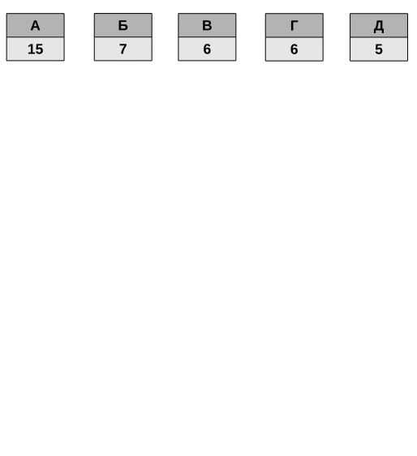

###### Практична робота №1
## Жадібність та шифрування

### Мета роботи:
Закріпити знання з жадних алгоритмів на прикладі реалізації одного з найвідоміших алгоритмів цього типу - кодування Хафмана. Також, оскільки це остання практична у термі, у вас є нагода піднабрати додаткових балів, виконавши різні варіанти ускладненого завдання.

## Трохи теорії
**Префіксний код** - код, що складається із слів, жодне з яких не є префіксом іншого слова. Наприклад, код з множиною можливих слів `0, 20, 34, 01` не є префіксним, бо `0` є префіксом до `01`, а `0, 2, 33, 45, 86, 101` - є префіксним кодом. Навіщо це потрібно? Коли ми записуємо або передаємо повідомлення записане префксним кодом, нам не потрібні роздільні символи! Повідомлення `20334533338602` можна легко розібрати на слова `2 0 33 45 33 33 86 0 2` саме завдяки такій властивості.

**Кодування Хафмана** - такий спосіб зашифрувати певну інформацію, щоб досягти максимальної ефективності у розмірі. Це досягається за рахунок двох властивостей:
1. Кожен символ шифрується змінним числом біт - чим частіше якийсь символ зустрічається в повідомленні, тим менше біт він займе (аж до одного біту для найчастішого символу)
2. Символи шифруються префіксним кодом, для того щоб не витрачати місце на роздільні символи

Власне, алгоритм Хафмана описує як маючи певне повідомлення отримати для нього таблицю підстановки "символ" - "код", так щоб ці коди задовольняли описаним властивостям.

Кодування Хафмана - дуже важлива частина багатьох добре знайомих вам речей, як-то алгоритмів архівації (GZIP, PKZIP) чи медіа кодеків (JPEG, MP3, PNG). Рекомендую перед початком виконання роботи витратити ще час на коротке та цікаве [відео по темі](https://www.youtube.com/watch?v=JsTptu56GM8).
 

В цій роботі ви реалізуєте кодування Хафмана та певну варіацію його застосування.

## Завдання
1. Прочитайте текстовий файл з диску та підрахуйте частоту символів у ньому. Це має бути зовсім не складно, для цього вам може стати в нагоді словник char -> int (символ -> кількість його входжень)
2. На основі отриманої таблиці частотності побудуйте дерево Хафмана. Ми розглядали детально цей процес на лекції, можете також звернутись до [цієї статті](https://www.techiedelight.com/huffman-coding/) за описом, також достатньо гарно написано [тут](https://www.programiz.com/dsa/huffman-coding) або [на вікіпедії](https://en.wikipedia.org/wiki/Huffman_coding). 
3. Якщо коротко: створіть чергу з вузлів, що представляють символи та їх частоту в тексті, далі ітеративно діставайте з черги два найменших елементи та додавайте у чергу один новий елемент, що має два попередніх за дочірні та значення, що має суму значень доічрніх елементів. Так, крок за кроком ви побудуєте дерево, після чого пронумеруйте для кожної вершини шлях наліво - нулем, направо - одиницею (або навпаки, це не так принципово).

   
4. Маючи дерево, складіть та виведіть на екран таблицю з кодуванням для кожного символа. Для того щоб отримати код символу, потрібно поступово спускатись з кореня дерева до потрібної вершини, запам'ятовуючи всі 0 та 1 на шляху

Викоання завдання до цього етапу принесе вам _3 бали_. Якщо замість черги ви зможете вплести в 3 пункт min heap, то отримаєте _+2 додаткових бали_. 

Маючи таблицю для кодування, ми тепер маємо її використати! Тут у вас є три варіанти:
1. Закодуйте оригінальний текст у новий текстовий файл, записуючи в нього безпосередньо 0 та 1 у текстовому форматі (зміст файлу буде мати вигляд типу `01010101101001010111`). Прочитайте цей файл та розшифруйте його назад
2. **Більш правдоподібний, але все ще текстовий (1 + 1 додатковий бали)**. Для успішного розшифрування файлу нам потрібно мати таблицю кодування. У минулому пункті ми її могли просто перевикористати, але у повноцінному архіві вся інформація для разархівування має бути у самому файлі - подумайте як, та додайте до файлу таблицю для декодування.
3. **Цифровий (1 + 2 додаткових бали)**. Писати текстовий файл з нулями та одиницями нераціонально - символ `0`, це такий же символ як і `a` чи `b`, і отриманий файл буде тільки більше в розмірі. Але ж якщо `a` кодується як `1100`, то це ж просто двійкове представлення числа 12! Давайте спробуємо писати у файл не текст, а байти - один байт = код одного символу. Не забудьте про таблицю кодування!
4. **Бінарно-хардкорний (1 + 4 додаткових бали)**. Якщо символ `a` має код `0`, то це означає, що він потребує всього одного біту інформації, а не цілих 8, як у попередньому пункті. Спробуйте записти код у файл максимально ефективно, для цього вам доведеться писати код біт за бітом та активно використовувати бітові операції. Пам'ятайте, що ми не можемо записти один біт у файл, а завжди оперуємо байтами, тоже вам самостійно доведеться складати код у групи по 8.

## Контрольні питання
- Які алгоритми ми називаємо жадібними? Наведіть декільки прикладів таких алгоритмів.
- Що таке префіксні коди?
- Які ідеї закладені у кодування Хафмана?
- За рахунок чого зашифрований текст кодуванням Хафмана займає менше місця (тобто, можна вважати його заархівованим)?

## Оцінювання

Максимальний бал - 8 (+6 можливих додаткових бали):
- Створення та виведення на екран таблиці кодування Хафмана для обраного текстового файлу - _3 бали_;
- Запис та читання закодованого (заархівованого) файлу у обраному у форматі - _1 бал + (0-4) додаткових_;
- відповіді на теоретичні питання - _2 бали_;
- використання структуру min heap припобудові дерева - _+2 бали_;
- виконання додаткового практичного завдання при здачі - _2 бали_;
