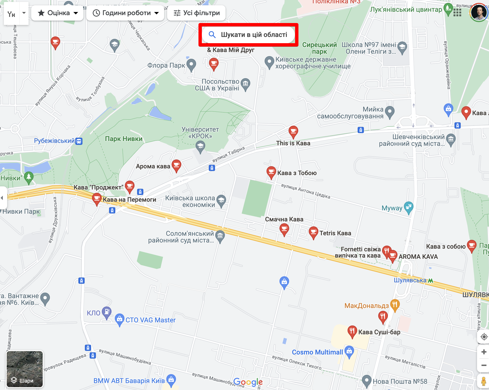
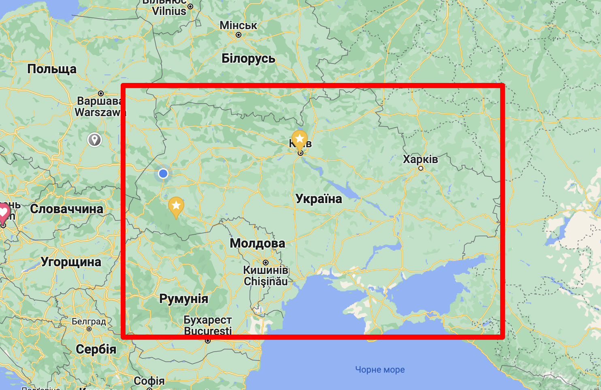

###### Практична робота №6
## Магазини, дерева та геометрія

### Мета роботи:
Попрактикуватись в проектуванні більш складних дерев, реалізувати декілька геометрічних алгоритмів, повторити обробку текстових файлів.

## Що будемо робити?
Реалізовувати функціонал, аналогічний натисканню кнопки "шукати в цій области" при пошуку чогось корисного на Google Maps - спочатку очевидним способом (лінійно, перебором), а потім оптимізованим (використовуючи дерево)


## Порядок виконання
### Лінійне рішення

Скачайте та подивіться [файл з данними](./../res/ukraine_poi.csv) - це скачані та попередньо оброблені точки з [OpenStreetMap](https://www.openstreetmap.org/#map=6/48.537/31.168). Кожна точка - певний обʼєкт в Україні - його координати (широта та довгота), тип та назва.

Напишіть просту консольну програму на C#, що приймає від користувача широту та довготу точки та радіус кола в якому слід дивитись. Програма має вивести всі точки, що потрапляють в цей радіус. Приклад програми:
```
> map_search.exe --db=ukraine_poi.csv --lat=30.212, --long=35.872 --size=20
Next points were found in given area:
1.
2...
```
На цьому етапі розвʼяжіть задачу перебором - продивість кожну точку, визначте відстань до заданої точки та виведіть її на екран якщо відстань менша за задану.

Зверніть увагу, що координати точки - це широта та довгота, які визначають положення точки на земній кулі, а не на площині. Одному градусу широти на екваторі відповідає значно більше кілометрів відстані, ніж одному градусу біля полюсу, тому для визначення відстані між точками за відомими координатами потрібно розібратись з такою штукою як [гаверсинус](https://uk.wikipedia.org/wiki/%D0%A4%D0%BE%D1%80%D0%BC%D1%83%D0%BB%D0%B0_%D0%B3%D0%B0%D0%B2%D0%B5%D1%80%D1%81%D0%B8%D0%BD%D1%83%D1%81%D0%B0). [Ось тут](https://www.movable-type.co.uk/scripts/latlong.html) можна отримати формулу та перевірити правільність власних обчислень

Для того щоб заміряти ефективність, додайте до свого коду наступний:
```C#
 var sw = new Stopwatch();
 sw.Start();
 // here goes code you want to measure
 sw.Stop();
 Console.WriteLine($"Elapsed time: {sw.Elapsed}");
```
`Stopwatch` дозволяє виміряти час виконання коду, що виконується між викликами методів `Start()` та `Stop()`. Виміряйте час, який займає повний перебір усіх точок.

**Увага! Щоб отримати бали за цю частину роботи, її треба здати до 28.04 (включно із заняттям)**

### Оптимізоване рішення
Час переходити до оптимізації! Ми будемо використовувати структуру даних, відому як `K-d tree` (K-dimensional tree, багатовимірне дерево), почитайте про неї на [вікі](https://en.wikipedia.org/wiki/K-d_tree). Проте, якщо класична варіація цієї структури містить точки як вершини дерева, то для нашої задачі зручніше використовувати прямокутники. Отже, побудова дерева:

1. Визначте прямокутник, який містить всі точки з множини (технічно, це не зовсім прямокутник, бо він описує частину поверхні кулі, але ми можемо використати таке спрощення) - для цього знайдіть мінімальну та максимальну довготу та широту серед усіх точок. Створіть кореневий вузол дерева, що містить інформацію про цей прямокутник.
   
2. Знайдіть медіану всіх точок всередині прямокутника за широтою або довготою (тобто значення, при якому половина точок мають більше значення, а половина - менше). Розділіть прямокутник на два по цій лінії, створіть вузли дерева та призначте їх нащадками вершини з попереднього пункту.
3. Для кожного з прямокутників з пункту 2 повторіть процес, тільки змінивши вісь - якщо попередньо ви ділили по довготі, тепер діліть по широті та навпаки
4. Повторюйте ділення поки всередині одного прямокутника не лишиться невелика кількість точок (наприклад, 10 чи 100).
У підсумку, ви матимете бінарне дерево, де кожна віршина містить прямокутник, а листя - ще й набір точок

Пошук у дереві:
1. Для того щоб спростити обчислення, та звести їх до відомої вам формули перетину двох прямокутників, слід знайти прямокутник, що описує коло, в якому ми виконуємо пошук. В цьому вам допоможе розділ ["destination point given distance and bearing from start point"](https://www.movable-type.co.uk/scripts/latlong.html)
2. Перевірте, чи перетинається прямокутник з коренем дерева. Якщо ні - точок немає, якщо так, перевірте рекурсивно нащадків. Кожен раз, спускаючись на рівень нижче, відкидайте прямокутники що не перетинаються з необхідним.
3. Якщо при спуску в дерево ви знайшли вершину, що вже не містить нащадків, переберіть всі точки в ній і перевірте їх відстань.

Замірте окремо час побудови дерева, і окремо - час виконання запиту у цьому дереві. Порівняйте час виконання з перебором, які можна зробити висновки?

Є більш ефективна структура даних для виконання подібних географічних запитів - [R-tree](https://en.wikipedia.org/wiki/R-tree). В нашому курсі передбачається теоретичний розгляд цієї структури (на лекції)

## Контрольні питання
- Які алгоритми називаються геометричними? Наведіть декілька прикладів.
- Як працюють Kd-дерева та R-дерева? В чому між ними різниця?
- Як можна визначити за даними координатами, чи перетинаються прямокутники?
- Як у C# можно додати підтримку символьних операторів до класів?

## Оцінювання

Максимальний бал - 8:
- Реалізація простої, лінійної схеми пошуку на відповідному занятті - _+1 бал_;
- Побудова Kd-tree - _2 бали_;
- Пошук у дереві - _2 бал_;
- Теоретичні питання - _2 бали_;
- Виконання додаткового практичного завдання при здачі - _2 бали_;
