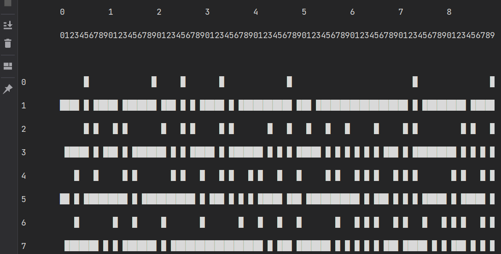
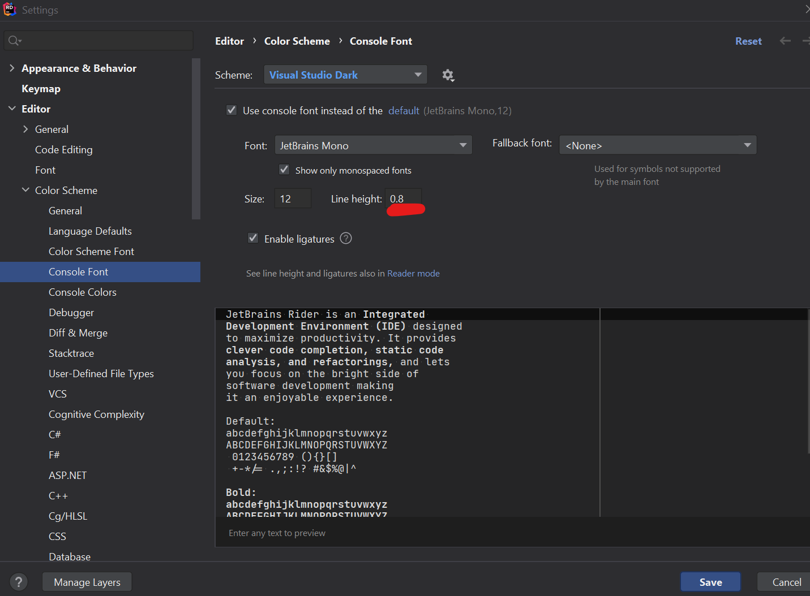
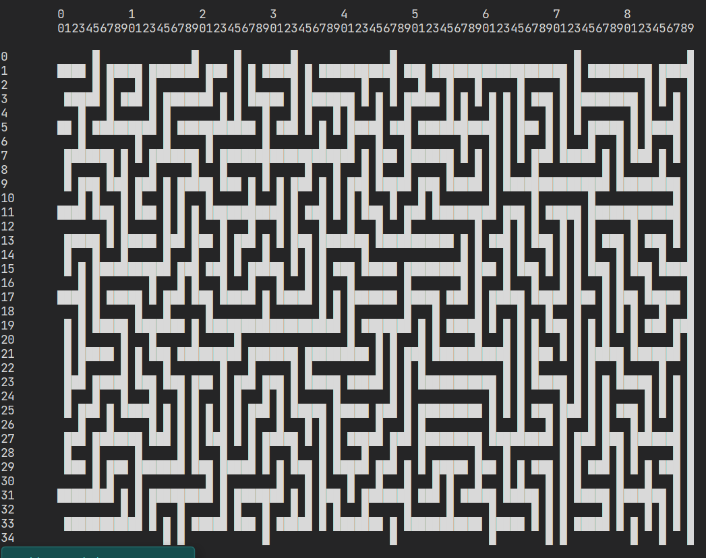
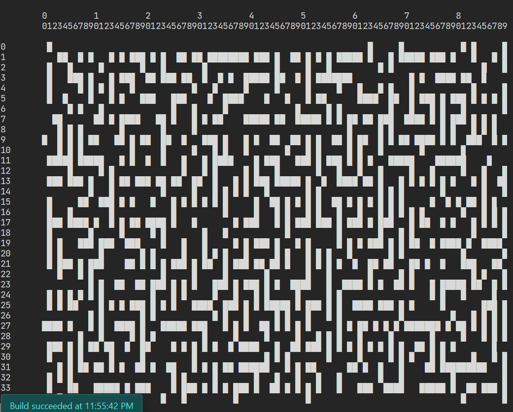
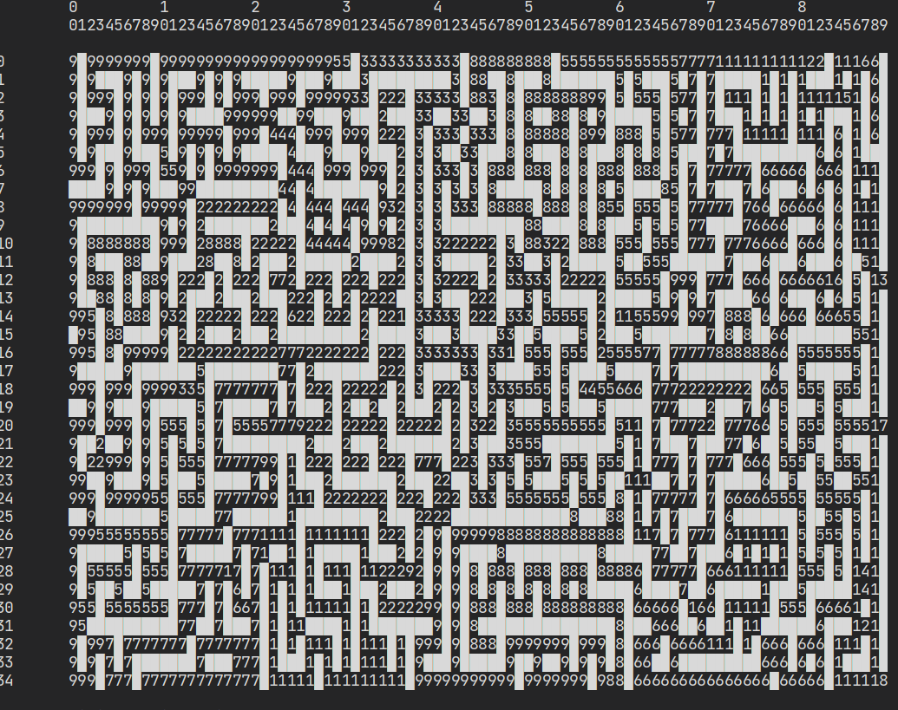

###### Практична робота №2
## Doodle Maps та пошук шляхів

### Мета роботи:
Розібратись з алгоритмами пошуку шляхів A* та Дейкстри, навчитись працювати з графами заданим двомірною сіткою 

## Порядок виконання

### Основне завдання

1. Створіть новий проект та репозиторій. Нагадаємо, що кожна практична має виконуватись в окремому репозиторії, а вклад кожного учасника має бути видимим у коммітах.
2. Скопіюйте в новий проект всі .cs файли з папки [MapGenerator](./../archive/samples/MapGenerator). Ці чотири класи які нам необхідні для генерації карт, по яким ми будемо шукати шляхи.
3. Почніть ваш проект з наступного шаблону коду:
```C#
using Kse.Algorithms.Samples;

var generator = new MapGenerator(new MapGeneratorOptions()
{
    Height = 35,
    Width = 90,
});

string[,] map = generator.Generate();
new MapPrinter().Print(map);
```
В цьому коді спочатку створюється об'єкт типу `MapGenerator`, при чому замість того щоб передавати велику кількість аргументів про те яку саме карту створити, всі ці аргументи загорнуті в окремий об'єкт `MapGeneratorOptions`, по якому зручніше бачити що ми задаємо ширину та довжину карти. Потім ми генеруємо карту, яка є просто двомірним масивом рядків, де стінки позначені символом `█`. В останньому рядку ми створюємо ще один об'єкт - який може виводити карту на екран та викликаємо метод для того щоб її побачити. Якщо ви все зробили правильно та запустите програму зараз, то побачите таке:


Це не дуже схоже на карту, але проблема тільки в тому що Rider за замовчуванням малює завеликі відступи між рядками в консолі. Щоб поправити це, перейдіть у налаштування `File > Editor > Color Scheme > Console Font` а виставіть Line Height у значення 0.8



Якщо перезапустити програму після цього ми побачимо правильний лабіринт:



Тепер розглянемо всі варіанти параметрів, що можна задати у `MapGeneratorOptions`:
- **Width** - ширина карти у символах
- **Height** - висота карти у символах
- **Seed** - значення випадковості, за яким генерується карта. Якщо ви будете ставити його в одне і те саме число, то карта буде генеруватись одна і та ж. Якщо не задавати, то карта буде щоразу різна
- **Noise** - параметр від 0 до 1 який дозволяє прибрати частину стінок. Наприклад, результат при Noise = 0.3:


4. Час виконувати завдання!
Додайте до програми та реалізуйте наступну функцію:

```C#
List<Point> GetShortestPath(string[,] map, Point start, Point goal)
{
    // your code here
}
```
Ця функція має приймати на вхід карту, дві точки (початкову та цільову) та повертати список з точок що складають найкоротший шлях за алгоритмом Дейкстри. Щоб оновити в пам'яті алгоритм, зверніться до:
- [короткої статті](https://www.programiz.com/dsa/dijkstra-algorithm),
- більш розгорнутого, але трохи нудного [опису на вікі](https://en.wikipedia.org/wiki/Dijkstra%27s_algorithm).
- Chapter 7 в Grokking Algorithms (для кращого розуміння потрібно прочитати і 6 главу також)
- дуже детального та [ілюстрованого гайду](https://www.redblobgames.com/pathfinding/a-star/introduction.html)

5. Для того щоб було зручно виконувати попередній пункт, почніть з модифікації методу `Print()` у `MapPrinter.cs`. Розширьте його так, щоб він додатково приймав список точок:

```C#
public void Print(string[,] maze, List<Point> path)
{
 // your code
}
```
При малюванні карти, зробіть так, щоб перша точка відображалась символом `А`, остання - `В`, а всі інші - крапками. Якщо ви почнете з цього, буде значно легше дебажити всю програму, оскільки завжди буде легко виводити шлях на екран

6. Під час виконання завдання, у вас виникне необхідність якось запам'ятовувати поточну мінімальну кількість кроків вд початкової до певної точки, а також вершину, з якої треба прийти, щоб мати цю кількість кроків. У вас є декілька варіантів щоб зробити це:

а) створити два додаткових двомірних масиви для вісдстаней та точок, такої само розмірності, як і масив, який містить граф.

```C#
  int[,] distances = new int[graph.GetLength(0), graph.GetLength(1)];
  Point[,] origins = new Point[graph.GetLength(0), graph.GetLength(1)];
```
І після цього записувати в ці масиви довжину шляху та точки відповідно:
```C#
  distances[point.Row, point.Column] = distance;
  origins[point.Row, point.Column] = origin;
```
Це простий варіант, але не надто ефективний, оскільки він потребує додатково `2n` пам'яті.

б) використати словник. Словник в C# працює так само як і в пайтоні, але потрібно обов'язково вказувати тип ключів та тип значень:
```C#
  // declare
  var distances = new Dictionary<Point, int>();
  var origins = new Dictionary<Point, Point>();
  
  // and use
  distances[point] = distance;
  origins[point] = origin;
```

7. Як відправну точку для виконання завдання можете використовувати приклад з лекції про [розфарбування графа](./../archive/samples/Filling/Coloring.cs) - там є робота з графом, заданим масивом рядків, є доставання сусідів заданої точки, є навіть пошук в ширину (нагадую, що для незважених графів порядок обходу алгоритмом Дейкстри перетворюється на пошук в ширину)

### Додаткове завдання
1. Додайте до параметрів генерації карти `AddTraffic` та певне число `Traffic Seed`

```C#
var generator = new MapGenerator(new MapGeneratorOptions()
{
    Height = 35,
    Width = 90,
    Noise = .1f,
    AddTraffic = true,
    TrafficSeed = 1234
});
```

Тепер при генерації карти вона містить значення заторів! До речі, затори додаються пошуком в глибину на випадкове значення глибини та сили затору



1. (+1 бал) Модифікуйте програму, так щоб вона враховувала затори. Вважайте, що для того щоб виїхати з точки, що містить значення n (від 1 до 9) потрібно їхати зі швидкістю `v=60 - (n-1)*6`км\год. Тобто, 1 - 60 км\год, а 9 - 12 км\год. Після виведення шляху напишіть сумарний час поїздки
2. (+1 бал) Переробіть програму на алгоритм А*, в якості еврістики рахуйте манхетенську відстань від точки до цілі (тобто сума клітинок по горизонталі та діагоналі), або звичайну геометричну (за теоремою Піфагора)

## Додатковий матеріал
1. [Візуалізація пошуків шляхів](https://qiao.github.io/PathFinding.js/visual/)

## Контрольні питання
1. Опишіть алгоритми Дейкстри та A*, що таке еврістика і для чого вона потрібна?
2. Що таке пошук в глибину та ширину?
3. Що таке кістякове дерево та якими алгоритмами його можна шукати?
4. Яка реалізація черги з пріоритетом дозволяє зробити більш ефективну реалізацію алгоритму Дейкстри?

## Оцінювання
Максимальний бал - 8 (+2 можливих додаткових бали):
- реалізація алгоритму пошуку шляхів - _4 бал_;
- відповіді на теоретичні питання - _2 бали_;
- виконання додаткового практичного завдання при здачі - _2 бали_;
- реалізація заторів та A* - _+2 бали_


