# Заливання першого проєкт на git

Почнемо з того що ми створили новий проєкт і отримали новий каталог (directory). Наприклад:
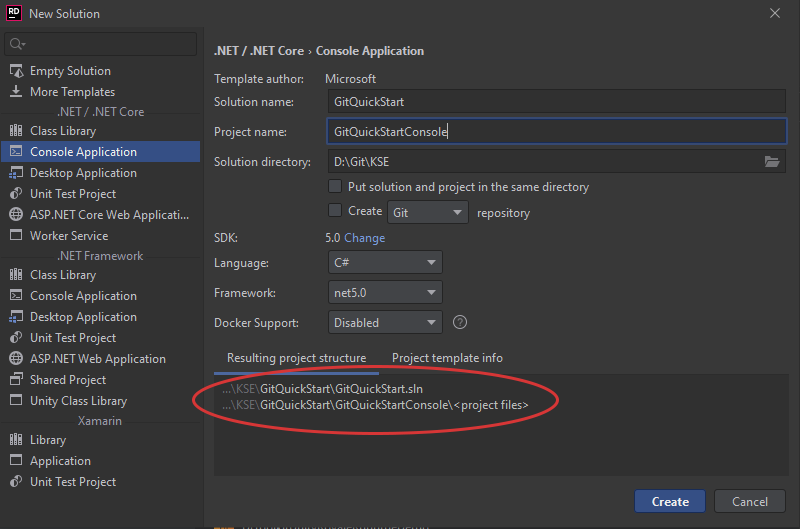
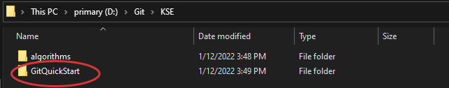

Далі для того, щоб надалі використовувати Git нам потрібно:
1. Ініціалізувати новий репозиторій у створеному каталозі проєкт
2. Створити правила, за якими будуть ігноруватись непотрібні іншим розробникам файли
3. Всі необхідні файли проєкт додати у stage area за допомогою "git add \<file\>..."
4. Зробити перший локальний комміт з обраними змінами
5. Створити віддалений репозиторій. Наприклад, на GitHub.
6. Додати віддалений репозиторій до вже наявного локального репозиторію та залити файли за допомогою "git push"

## За допомогою терміналу та інтерфейсу командного рядка (CLI):
#### 1. Ініціалізувати новий репозиторій у створеному каталозі проєкт

Запустіть будь-який термінал та перейдіть у каталог вашого створеного проєкту. У нашому прикладі буде використовуватись Git Bash,
що можна встановити під час встановлення самого Git.  
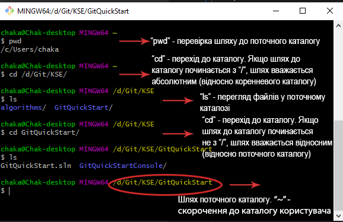

За допомогою "git init" ініціалізується порожній репозиторій у поточному каталозі. Ми можемо виконати команду "git log",
щоб подивитися на історію коммітів, але вона лише підтвердить що поточна гілка репозиторію ще не містить коммітів.  
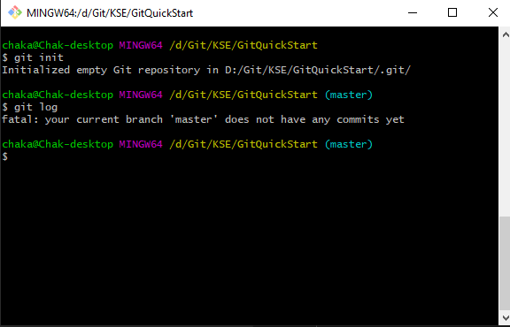

Для того, щоб переглянути нові та змінені файли, виконаємо команду "git status". Наразі ще не один файл не був доданий до git, а список
не доданих файлів відповідно зображено внизу. Це каталог GitQuickStartConsole, файл GitQuickStart.sln та каталог .idea/. Всі вони
були автоматично згенеровані при створенні нового проєкт, але каталог .idea/ містить специфічні файли налаштування проєкт в Rider
([детальніше](https://rider-support.jetbrains.com/hc/en-us/articles/207097529-What-is-the-idea-folder-)).  
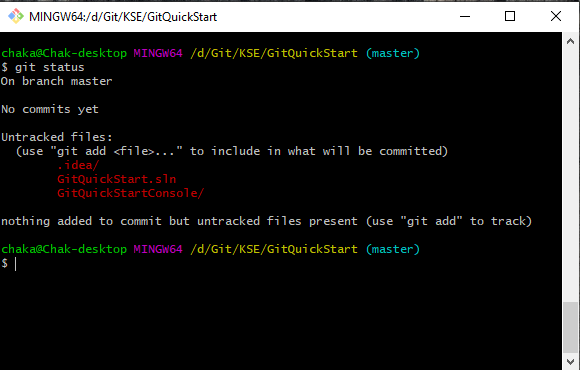

#### 2. Створити правила, за якими будуть ігноруватись непотрібні іншим розробникам файли
Більшість файлів з каталогу .idea/ не потрібні іншим розробникам для сумісної роботи над проєктом в репозиторії. Вони будуть автоматично
згенеровані в їх IDE при необхідності. Таким чином, нам потрібен механізм, який дозволив би ігнорувати наявність або зміни в обраних нами файлах,
або файлах що підпадатимуть під певні критерії.

Цим механізмом виступають правила у файлі .gitignore. Детальніше познайомитись з .gitignore можна [за посиланням](https://www.pluralsight.com/guides/how-to-use-gitignore-file).

Для використання .gitignore потрібно лише додати будь-яким шляхом файл з такою назвою в репозиторій та внести в нього текстом список правил, за якими будуть
ігноруватись файли. Для початку достатньо використати готовий набір, створений для проєктів C# + Rider, скопіювавши його з
[цього файлу](./res/git_quickstart/gitignore_template.txt).

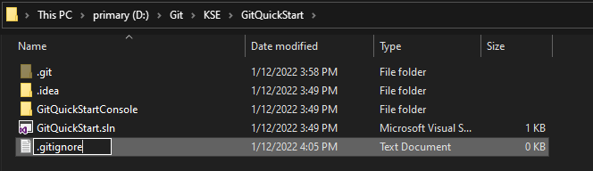

Одразу після цього в "git status" буде видно створений .gitignore файл, а проігнорований каталог .idea/ взагалі не буде показуватися у змінених файлах.  
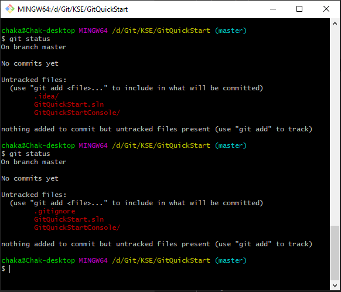

#### 3. Всі необхідні файли проєкту додати у stage area.
Для того, щоб зробити комміт, який містив би в собі всі необхідні зміни, потрібно спочатку ці зміни згрупувати. Такою посередньою ланкою
являється staging area. Тобто спочатку ми додаємо файли до неї, а після - підписуємо їх повідомленням, утворюючи комміт.

Додавання змін в staging area відбувається за допомогою команди "git add". Додати можна як файл, так і каталог. Таким чином, на нашому прикладі,
ввівши "git add GitQuickStart.sln' ми додамо до staging area тільки файл GitQuickStart.sln. Однак, якщо ми виконаємо "git add GitQuickStartConsole/", то
до staging area додадуться всі файли всередині каталогу ./GitQuickStartConsole/.

Варто зазначити що символ крапки "." відповідає за поточний каталог, тобто "./GitQuickStartConsole/" та "GitQuickStartConsole/" - одне й те ж саме
та відповідає каталогу з назвою GitQuickStartConsole всередині того каталогу, в якому ми зараз знаходимось. Крапка може знадобитись коли ми, наприклад,
хочемо передати в команду саме поточний каталог, а не тільки один з його файлів\підкаталогів. Так, "git add ." додає у staging area взагалі всі зміни
файлів та каталогів, що знаходяться в поточному каталозі. На прикладі каталогу нашого репозиторію, "git add ." додасть у staging area і файли ./.gitignore
та ./GitQuickStart.sln, і підкаталог ./GitQuickStartConsole/ зі всім його наповненням.

#### 4. Зробити перший локальний комміт з обраними змінами
Зі створенням комміту все дуже просто. Команда "git commit" просто візьме всі актуальні зміни зі staging area та запропонує додати до них повідомлення, що
описує зміст виконанних змін. Змістовне найменування повідомлень коммітів є дуже важливою частиною ефективної командної та індивідуальної роботи, однак ця тема
буде більше розкрита вже під час виконання робіт.

Для майже кожної команди в git є деяка кількість різноманітних параметрів різного призначення. [Їх список](https://git-scm.com/docs) дуже просто знайти за відповідними пошуковими запитами.
Гарним прикладом такої команди є параметр "-m <msg>". Він дозволяє вводити повідомлення комміту не у окремому вікні  після введення самої команди "git commit",
а одразу ж в цій команді, тим самим минаючи не найзручніший інтерфейс. Тобто команда буде виглядати наступним чином: git commit -m 'Some commit message here'.
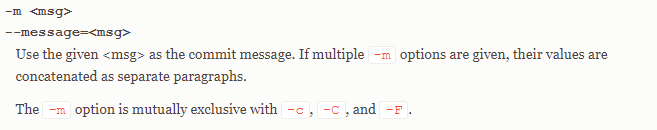

Створимо із доданих раніше у staging area файлів комміт та дамо йому назву 'Initial commit', відповідну початковому стану проєкту:
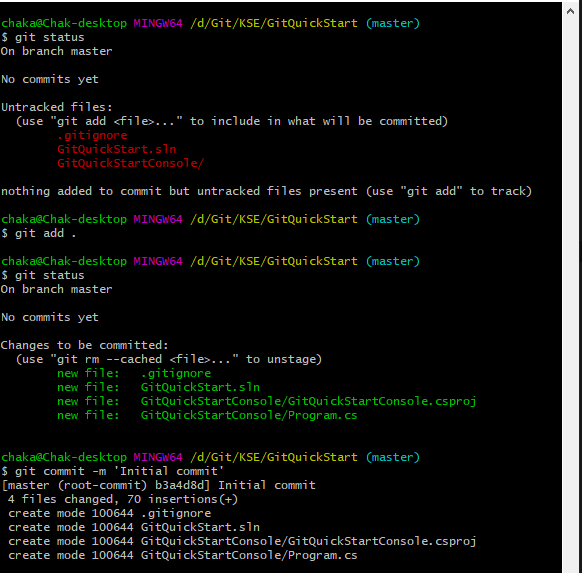

#### 5. Створити віддалений репозиторій.
Прикладом розміщення віддаленого репозиторію в нашому випадку буде служити GitHub, однак насправді віддаленим репозиторієм може бути все що завгодно: від
репозиторіїв у сервісах на кшталт GitHub чи GitLab і аж до можливості зробити віддаленим репозиторієм інший локальний репозиторій на вашому ж комп'ютері.

Для GitHub створюємо новий репозиторій, але не обираємо нічого в пунктах, пов'язаних з "Initialize this repository with". Ми вже ініціалізували наш репозиторій у
себе локально і нам лише потрібно пусте сховище, щоб залити туди наші комміти.
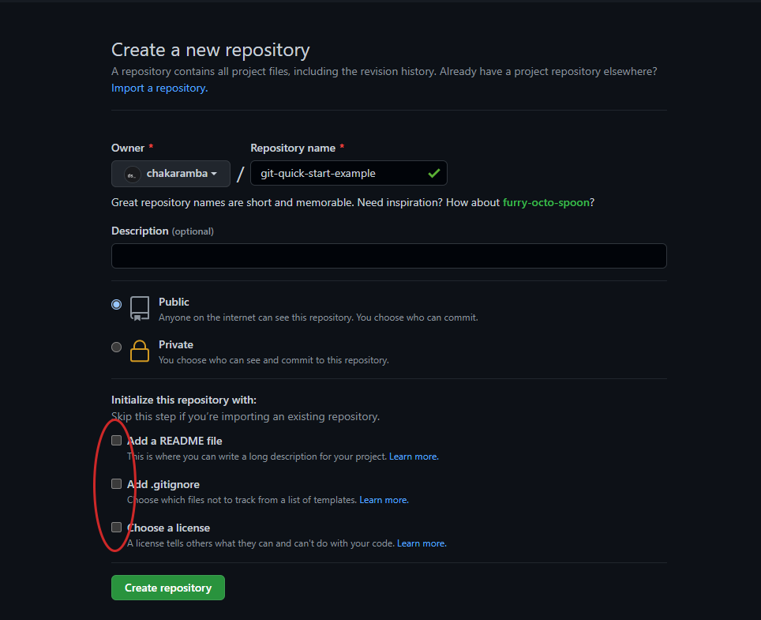

Власне, отримуємо порожній репозиторій та декілька підказок-інструкцій щодо того як залити туди: створення нового репозиторію локально та залиття його в цей
репозиторій на GitHub і другий варіант з залиттям вже наявного локального репозиторію (наш варіант). Для подальшої роботи нам потрібно буде лише скопіювати
https посилання на репозиторій, за допомогою якого ми можемо пов'язати локальний репозиторій з віддаленим.
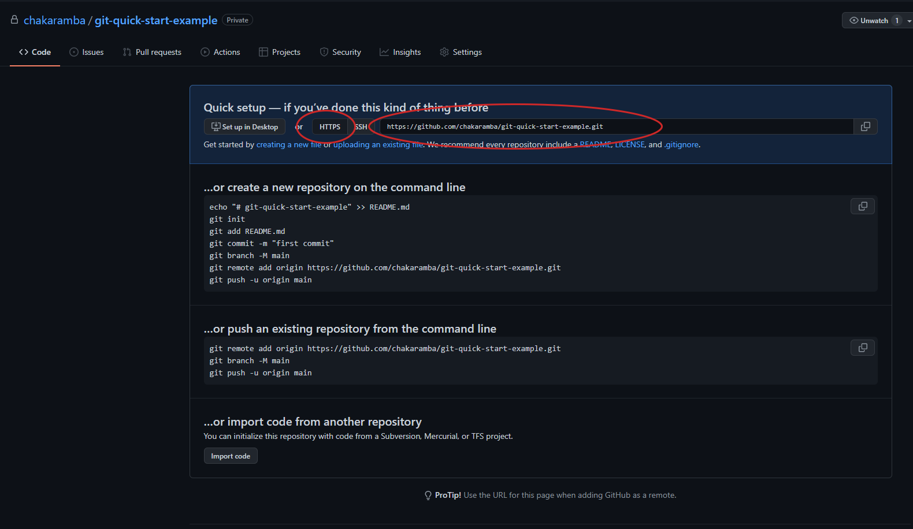

#### 6. Додати віддалений репозиторій до вже наявного локального репозиторію та залити файли за допомогою "git push"
Виконаємо команду "git log" щоб дерево коммітів поточної гілки. Зверніть увагу, що у повідомлені зазначено що HEAD (поточний стан) слідкує за нашою основною
гілкою master (у вас це може бути автоматично гілка main).

Опісля, виконаємо додавання нового віддаленого репозиторію по посиланню, що ми скопіювали у минулому пункті під час створення цього репозиторію. Закріпимо за
ним ім'я origin (Стандартне ім'я віддаленого репозиторію в Git. Однак, ви можете обрати і своє). Команда буде виглядати наступним чином:

    git remote add origin <посилання на ваш репозиторій>

Після того як ми додали до нашого локального репозиторію віддалений репозиторій зі скороченим ім'ям origin, ми можемо безпосередньо залити поточний стан необхідної
гілки на віддалений репозиторій за допомогою команди "git push" з параметрами "-u" (чи його не скорочена версія "--set-upstream") для того, щоб позначити гілки
як ті що повинні відображати одна одну\слідкувати та указанням куди залити зміни та з якої гілки (залити на віддалений репозиторій origin гілку master у нашому прикладі).

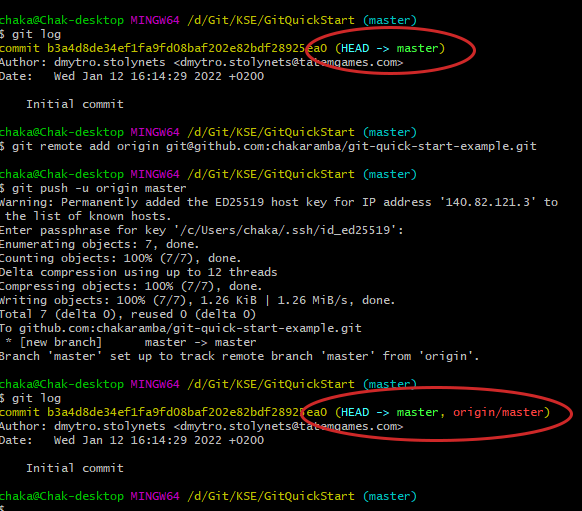

Зверніть увагу на те що тепер команда "git log" показує що не тільки наша локальна гілка master вказує на комміт 'Initial commit', а і відповідна гілка на віддаленому
репозиторії origin/master також вказує на той самий комміт, а значить - стан гілок локальної та віддаленої синхронізовано та в нашому віддаленому репозиторії нас вже
чекають всі файли та зміни, які ми додали в наші комміти на цій гілці.